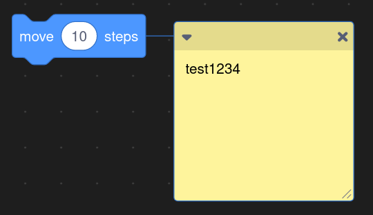
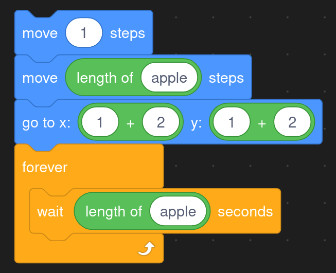
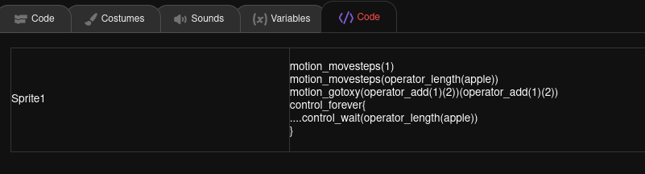

# block2text

Addon for scratch that convert blocks to text

Table of feathures

| Scratch Features  | Block2Text status |    Comments                                       |
|:-----------------:|:-----------------:|:-------------------------------------------------:|
| Blocks            |   90%             | Working but inputs are problem \/                 |
| Inputs            |   50%             | Multiple inputs inside one input block are problem|
| Custom blocks     |   60%             | Custom block call need work on inputs             |
| C blocks (if,loop)|   80%             | Stil some bugs when multiple C-blocks are inside  |
| Comments          |   75%             | Need support for multiline comments               |
| Multiple Sprites  |   100%            | Seems working                                     |
| Extensions        |   100%            | No exta work but seems working                    |

| Additional Features   | Block2Text status |    Comments                                               |
|:---------------------:|:-----------------:|:---------------------------------------------------------:|
| Highlight JS          |   50%             |   Integration complete, line break dont work              |
| ??Git??               |   0%              | Only idea. (integrate git inside of scratch)              |
| Text2Blocks           |   0%              | Only idea. Is planed.                                     |
| Blocks2JS,PY,C,...    |   0%              | Only idea. (Translate Scratch blocks to funcional code)   |
| Light theme           |   0%              |                                                           |

